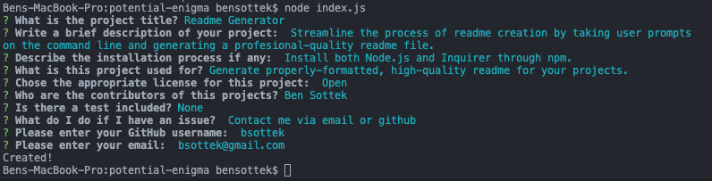

# Readme Generator
## Description 
    
Streamline the process of readme creation by taking user prompts on the command line and generating a profesional-quality readme file.
    
## Table of Contents
    
* [Description](#description)
* [Installation](#installation)
* [Usage](#usage)
* [Preview](#preview)
* [License](#license)
* [Contributing](#contributing)
* [Questions](#questions)
    
    
## Installation
    
Install both Node.js and Inquirer through npm.
    
## Preview 
    

## Usage
Generate properly-formatted, high-quality readme for your projects.
    
    
## License
    

    
    
## Contributing
    
Ben Sottek

## Questions
Contact me via email or github 
 
Find me on GitHub: [bsottek](https://github.com/bsottek) 
 
Email me with any questions: bsottek@gmail.com  